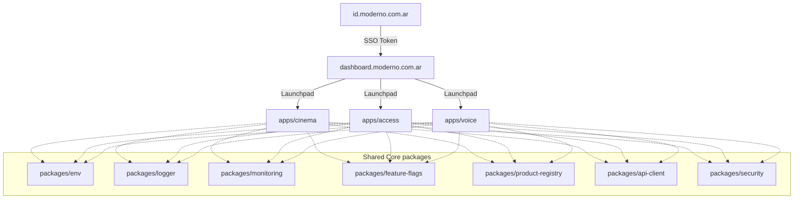

# Arquitectura de Plataforma Core
## Ecosistema Operativo de Moderno Style & Tech

Este documento detalla la infraestructura operativa, la organización del monorepo y las estrategias de escalabilidad para el ecosistema tecnológico de **Moderno Style & Tech**.

---

## 1. Diseño de Arquitectura General

El monorepo está construido sobre una arquitectura **Modular y Desacoplada (Loose Coupling / Zero Shared Database)**. A diferencia de las arquitecturas SaaS monolíticas tradicionales, cada aplicación de Moderno funciona de forma autónoma con su propio frontend, sus propios microservicios, bases de datos aisladas e integraciones de pagos individuales.

El plano central del monorepo (`packages/`) actúa como el **tejido conectivo** proporcionando estándares técnicos unificados de nivel enterprise (DX, branding, seguridad, entorno y observabilidad).

---

## 2. Responsabilidad de los Paquetes Compartidos (Packages)

Cada paquete en `packages/` cumple una única y estricta función operativa:

1.  **`packages/env` (Validación con Zod):** Garantiza que ninguna aplicación compile o arranque si faltan variables de entorno cruciales. Separa conceptualmente los entornos (`development`, `staging`, `production`) y asegura un tipado estricto en TypeScript.
2.  **`packages/logger` (Logs unificados):** Implementa logs formateados con niveles (`info`, `warn`, `error`, `debug`), colores en consola, timestamps estandarizados y soporte para **Request Tracing** mediante identificadores de peticiones (`requestId`).
3.  **`packages/monitoring` (Boilerplate de Observabilidad):** Wrapper agnóstico preparado para inyectar telemetría de errores (Sentry), comportamiento de usuarios (PostHog) y trazas de latencia distribuidas (OpenTelemetry) sin acoplar dependencias a las aplicaciones.
4.  **`packages/feature-flags` (Flags de Funcionalidades):** Permite encender o apagar microfeatures en caliente, controlando despliegues progresivos y accesos beta controlados.
5.  **`packages/product-registry` (Registro central):** Actúa como la única fuente de verdad sobre los metadatos de las 13 plataformas del ecosistema (categorías, subdominios, dependencias, estados y tiers de suscripción).
6.  **`packages/api-client` (Fetch Wrapper):** Unifica el cliente HTTP con soporte para políticas de reintentos con backoff exponencial, cancelaciones automáticas por timeout y control estricto de respuestas tipadas.
7.  **`packages/security` (Helpers de Seguridad):** Centraliza la inyección de Content Security Policy (CSP), cookies seguras de nivel `httpOnly` para evitar robos de sesión y control de cabeceras de respuesta recomendadas por OWASP.

---

## 3. Estrategia de Escalabilidad Multi-App

Para acomodar decenas de aplicaciones futuras sin incrementar la complejidad técnica:

*   **Frontends Independientes:** Cada aplicación es una SPA o app Next.js optimizada e independiente. Esto garantiza que un bug en la interfaz de un producto (ej. *Cinema Studio*) nunca afecte la operatividad de otro (ej. *Moderno Access*).
*   **Theme Engine Desacoplado:** Los componentes heredan estilos locales a través de variables CSS inyectadas en caliente a nivel de contenedor. Si agregas una nueva aplicación, solo debes inyectar su respectivo preset de marca sin alterar el código de la librería `@moderno/ui`.
*   **Portabilidad Local:** Los desarrolladores pueden compilar y arrancar subconjuntos específicos de la plataforma de forma local mediante filtros de Turborepo (`npx turbo run dev --filter=@moderno/cinema`), reduciendo drásticamente los recursos de hardware necesarios para trabajar.

---

## 4. Estrategia Futura Multi-Región

Para dar servicio a millones de usuarios globales con la menor latencia posible:

1.  **Ruteo Inteligente en el Edge:** Uso de CDNs en el Edge (Vercel / Cloudflare Workers) para despachar los archivos del frontend desde el nodo de red más cercano al usuario.
2.  **Bases de Datos Locales Distribuidas:** Dado que cada producto mantiene su propia base de datos, podemos ubicar geográficamente el Supabase o PostgreSQL de cada suite en la región de mayor tráfico (ej. Moderno Access en Sudamérica Este, Cinema Studio en AWS US-East).
3.  **SSO Cache Geográfico:** La autenticación centralizada (`id.moderno.com.ar`) expide JWT asimétricos firmados criptográficamente. Las aplicaciones pueden verificar la validez del token en el Edge de forma asíncrona decodificándolo localmente con la clave pública, eliminando latencias de red por validación de sesiones remotas.
