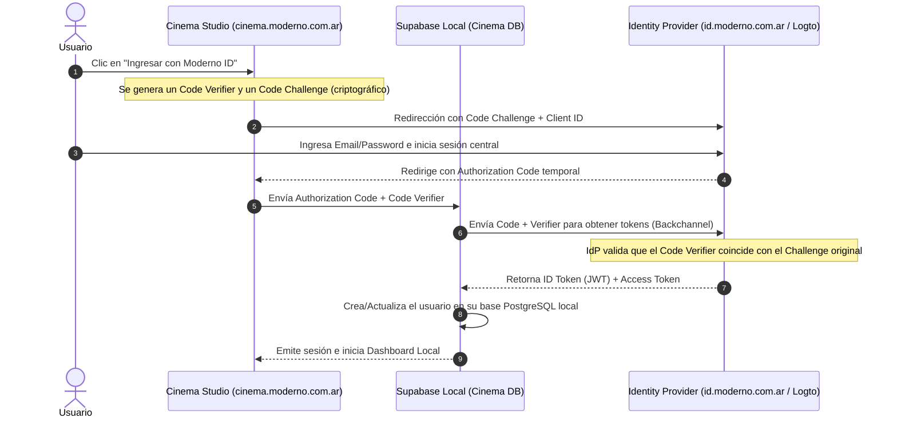

# Plan de Producción y Hardening de Seguridad para Autenticación (OIDC / SSO)
## Ecosistema Desacoplado Moderno Style & Tech

> [!WARNING]
> **PREVENCIÓN DE PRODUCCIÓN:** Los tokens generados en la demo visual (`apps/auth`) son estrictamente con fines de **vista previa UX y prototipado**. No se deben usar en producción bajo ninguna circunstancia. Este documento detalla la transición hacia un estándar seguro e industrial.

---

## 1. Por qué no se deben usar JWTs Caseros (Home-brew) en Producción

El desarrollo propio de un servidor emisor de JWTs (JSON Web Tokens) desde cero suele acarrear graves vulnerabilidades de seguridad:

1. **Gestión de Claves Inadecuada:** Los sistemas caseros suelen guardar las claves de firma (simétricas o asimétricas) en variables de entorno sencillas, exponiéndolas a fugas. En producción, se requieren Módulos de Seguridad de Hardware (HSM) o sistemas de rotación automática de llaves.
2. **Falta de Soporte para Revocación:** Los JWTs son independientes (stateless). Si un token es robado, invalidarlo en un sistema casero requiere lógica compleja (listas negras en Redis, etc.). OIDC cuenta con especificaciones estándar como **Token Revocation (RFC 7009)**.
3. **Vulnerabilidades Criptográficas Comunes:** Errores como aceptar el algoritmo `"none"` en el header del JWT o no verificar adecuadamente el emisor (`iss`), la audiencia (`aud`) y la expiración (`exp`) son causas frecuentes de hackeos masivos en implementaciones custom.
4. **Cumplimiento de Estándares:** Un sistema casero no es compatible nativamente con herramientas externas como Supabase Auth, Clerk o sistemas Enterprise (SAML/Active Directory) sin escribir miles de líneas de "código de pegamento" (glue code).

---

## 2. El Flujo Real en Producción: Authorization Code + PKCE

Para un ecosistema web/móvil moderno y desacoplado, el flujo recomendado es **Authorization Code Flow con PKCE (Proof Key for Code Exchange)**. Esto evita la transmisión de secretos criptográficos al frontend del usuario.



---

## 3. Firmas Criptográficas y JWKS (JSON Web Key Sets)

En un entorno real de OIDC, el Identity Provider central (`id.moderno.com.ar`) firma los JWTs usando **criptografía asimétrica** (usualmente algoritmos como **RS256** o **ES256**).

* **El IdP firma con su Llave Privada:** Esta llave se resguarda estrictamente en el servidor del IdP.
* **El IdP expone sus Llaves Públicas en un Endpoint JWKS:** Expone un archivo JSON en `https://id.moderno.com.ar/.well-known/jwks.json`.
* **Los Subdominios Verifican con la Llave Pública:** Cada Supabase local o backend de aplicación descarga periódicamente las llaves públicas desde el endpoint de JWKS y verifica criptográficamente que el token fue firmado por el portal central. **Ningún subdominio requiere conocer o almacenar secretos del IdP.**

---

## 4. Desacoplamiento de Base de Datos y Permisos Locales

Para mantener bases de datos completamente aisladas y respetar la regla de no mezclar datos de clientes (especialmente la de *Moderno Access*), la asignación de permisos debe ser **estrictamente local**:

1. **El Token Global solo dice "Quién es el usuario":**
   El JWT emitido por el IdP central contiene metadatos globales inmutables:
   ```json
   {
     "iss": "https://id.moderno.com.ar",
     "sub": "global_user_uuid_98765",
     "email": "cliente@correo.com",
     "name": "Jose Luis"
   }
   ```
2. **La Base Local determina "Qué puede hacer":**
   Cuando el Supabase local de *Cinema Studio* o *Moderno Access* valida el JWT anterior, busca (o crea mediante un trigger) un registro en su propia tabla local de usuarios y cruza la información con las tablas locales de roles y organizaciones:
   ```sql
   -- Esta tabla existe ÚNICAMENTE en la base de datos local de Cinema Studio
   CREATE TABLE cinema_workspace_members (
       id UUID PRIMARY KEY DEFAULT gen_random_uuid(),
       global_user_uuid UUID NOT NULL, -- UUID provisto en el token OIDC
       role VARCHAR(50) CHECK (role IN ('director', 'editor', 'viewer')),
       credits_remaining INT DEFAULT 100,
       created_at TIMESTAMP WITH TIME ZONE DEFAULT CURRENT_TIMESTAMP
   );
   ```
   * **Resultado:** Si el usuario es "Director" en Cinema Studio, tiene 100 créditos locales de renderizado. Si entra a *Moderno Access*, su rol ahí será "Residente" o "Administrador de Consorcio", completamente guardado en la base de datos física de Access. **Las bases de datos no se cruzan jamás.**

---

## 5. Proveedores de OIDC Recomendados para Producción

En lugar de programar todo un servidor OIDC (RFC 6749) compatible con PKCE y rotación de llaves, se recomienda usar soluciones ya certificadas:

### Opción A: Logto (Código Abierto / Self-Hosted)
* **Ventajas:** Extremadamente moderno, interfaz hermosa, soporte nativo de multi-tenancy y SSO corporativo. Puedes auto-hospedarlo en tu infraestructura de Render o AWS de forma gratuita.
* **Integración con Supabase:** Se configura en minutos como un *Custom OpenID Connect Provider*.

### Opción B: Supabase Auth Centralizado (Pure GoTrue)
* **Ventajas:** Si deseas mantenerte en el stack de Supabase, puedes crear una instancia de Supabase pura en `id.moderno.com.ar` y configurar tu aplicación como proveedor de SSO SAML 2.0. Sin embargo, para federar a otros Supabase locales, requiere configuraciones de Enterprise o pasarelas intermedias.

---

> [!IMPORTANT]
> **Resumen para Auditoría de Seguridad:**
> 1. Las contraseñas de los usuarios residen **única y exclusivamente** en la base de datos de `id.moderno.com.ar`.
> 2. Los subdominios nunca reciben ni procesan contraseñas; solo reciben tokens firmados de forma asimétrica.
> 3. Las bases de datos de cada aplicación SaaS son físicas y lógicamente independientes.
