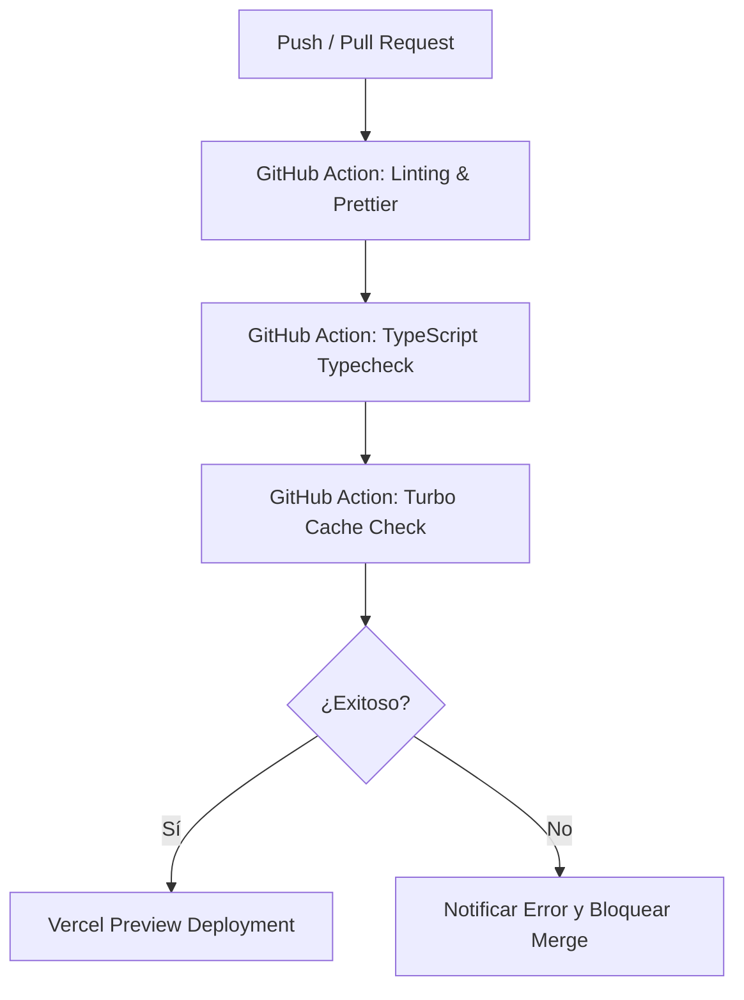

# Estrategia de Despliegue e Integración Continua (CI/CD)
## Flujo de Despliegue y Gestión de Secretos del Ecosistema Moderno

Este documento define las directrices, plataformas e infraestructura de integración continua necesarias para desplegar la suite de aplicaciones de **Moderno Style & Tech**.

---

## 1. Mapeo de Infraestructura y Despliegue

Cada componente del monorepo se aloja en plataformas SaaS específicas optimizadas para su función:

### Aplicaciones Web (Vercel)
Todas las aplicaciones Next.js (`apps/`) se despliegan en **Vercel** para aprovechar la infraestructura en el Edge, renderizado híbrido y optimizaciones automáticas de assets.
*   `apps/landing-main` $\rightarrow$ `moderno.com.ar`
*   `apps/auth` $\rightarrow$ `id.moderno.com.ar`
*   `apps/dashboard` $\rightarrow$ `dashboard.moderno.com.ar`
*   `apps/styleguide` $\rightarrow$ `styleguide.moderno.com.ar`
*   `apps/admin` $\rightarrow$ `admin.moderno.com.ar`

### Bases de Datos y Backend (Supabase / Render)
*   **Bases de Datos Relacionales (Supabase):** Cada producto aprovisiona una base de datos PostgreSQL aislada en Supabase, aprovechando su API de base de datos en tiempo real, almacenamiento de objetos y aislamiento absoluto de recursos.
*   **Servicios Web & APIs REST (Render / AWS ECS):** Las APIs customizadas y agentes de procesamiento asíncronos (como el procesador de video de Cinema Studio o el Gateway de Voz) se alojan como contenedores Docker administrados en **Render** para un escalado rápido y de bajo costo.

---

## 2. Gestión de Entornos (Staging vs. Production)

Para asegurar despliegues confiables sin interrumpir servicios productivos, implementamos tres fases de aislamiento estricto:

| Entorno | Rama de Git | URL Base | Objetivo |
| :--- | :--- | :--- | :--- |
| **Development** | Cualesquiera | `localhost` | Pruebas de código locales por desarrolladores. |
| **Staging** | `develop` | `*.staging.moderno.com.ar` | Entorno idéntico a producción para control de calidad. |
| **Production** | `main` | `*.moderno.com.ar` | Suite de producción accesible a usuarios finales. |

---

## 3. Manejo Seguro de Secretos (Variables de Entorno)

La seguridad de las llaves privadas de Stripe, OpenAI, Google AI y Supabase es crítica. La gestión sigue estas pautas estrictas:

1.  **Validación de Compilación:** Ningún deployment en Vercel o Render completará el build exitosamente si la validación del esquema de `@moderno/env` detecta la falta de una variable requerida.
2.  **Uso de Vercel Environment Variables:** Los secrets reales nunca se guardan en el código git ni en archivos `.env` locales del repositorio. Se configuran directamente en el panel administrativo de Vercel por proyecto y entorno.
3.  **Aislamiento de Secretos:** Las credenciales de base de datos de un producto (ej. Moderno Access) jamás se configuran en el entorno de otro (ej. Cinema Studio). Si ocurre una brecha de seguridad en una aplicación, el impacto se limita estrictamente a ese módulo aislado.

---

## 4. Pipeline de CI/CD (GitHub Actions)

El flujo de integración continua está automatizado mediante workflows de GitHub Actions en cada Pull Request a las ramas `develop` y `main`:

*   **Paso 1 (Calidad de Código):** Se ejecuta `npx eslint` y `prettier --check` a través de todas las aplicaciones del monorepo.
*   **Paso 2 (Validación de Tipos):** Se compila TypeScript en modo verificación (`tsc --noEmit`) para capturar incompatibilidades de interfaces compartidas.
*   **Paso 3 (Turbopack Build):** Se corre `npx turbo run build` aprovechando la memoria caché distribuida de Turborepo para compilar únicamente los paquetes y aplicaciones modificadas en el commit, acelerando drásticamente los tiempos del pipeline.
*   **Paso 4 (Preview Deployments):** Vercel genera una URL temporal única para que el equipo pueda probar la versión exacta del commit antes de autorizar el despliegue a producción.
